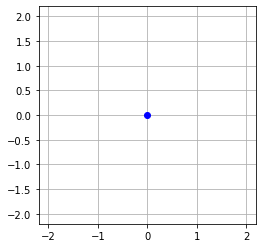
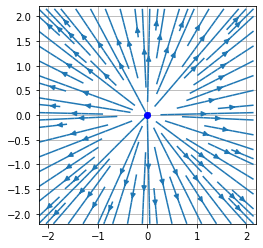
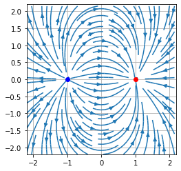

久々の投稿です。なかなか記事にするアイディアがなく、のんびり考えながらキーボードを叩いています。

さて、今回はPythonを用いて電場の可視化についてお話しようと思います。

# ベクトル場の可視化
まず最初にベクトル場の可視化について、簡単に例を挙げながら説明します.
2次元ベクトル場を
$$\vec{F} = \left( F_x(x, y), F_y(x, y) \right)$$
について、
$$F_x = y, F_y = -x$$
とすると、以下のコードのように書けます。
```python
import numpy as np
import matplotlib.pyplot as plt

plt.figure()

LX=2.2
LY=2.2

gridwidth=0.05
x, y= np.meshgrid(np.arange(-LX, LX, gridwidth), np.arange(-LY, LY,gridwidth)) 

Fx = y
Fy = -x

# ベクトル場をプロット
plt.streamplot(x,y,Fx,Fy)

# x,yの描画範囲
plt.xlim([-LX,LX])
plt.ylim([-LY,LY])

# グラフ描画
plt.axes().set_aspect('equal')
plt.grid()
plt.draw()
plt.show()
```


今回はstreamplotで表示しましたが、他にもquiverなど様々な表示方法があります。
また、`numpy.meshgrid()`は１次元配列を受け取って格子点を生成する関数です。数値計算においては、平面上あるいは空間内の各点に定義された量を表す時、とても便利です。

# 電場に関するクーロンの法則
では、上記の方法を使って点電荷が作る静電場を可視化してみたいと思います。<br>
まず、原点にある点電荷を点として表示すると次のようになります。
```python
import numpy as np
import matplotlib.pyplot as plt

plt.figure()

#グラフ範囲を指定
LX, LY = 2.2, 2.2

# 点電荷の座標(x, y)=(0,0)を指定
x_0, y_0 =0, 0
plt.plot(x_0, y_0, 'o', color = 'blue')

# x,yの描画範囲指定
plt.xlim([-LX, LX])
plt.ylim([-LY, LY])

plt.axes().set_aspect('equal')
plt.grid()
plt.draw()
plt.show()
```

<!-- ここに画像を入れる -->

点電荷の表示方法がわかったところで静電場を可視化してみたいと思います。<br>
原点にある点電荷が作る電場のx,y成分は、クーロン定数$k$、点電荷 $q$を用いて、クーロンの法則より、
$$E_x=\frac{k q}{r^2}\frac{x}{r}$$
$$\displaystyle E_y=\frac{k q}{r^2}\frac{y}{r}$$
となります。よって、
```python
import numpy as np
import matplotlib.pyplot as plt

plt.figure()

#グラフ範囲を指定
LX, LY = 2.2, 2.2

#  ベクトル場のベクトルの根本の間隔の変数を gridwidth とし、根本の座標のリストをx,yとします。
gridwidth=0.05
x, y= np.meshgrid(np.arange(-LX, LX, gridwidth), np.arange(-LY, LY,gridwidth)) 

# 点電荷の座標(x, y)=(0,0)を指定
x_0, y_0 =0, 0
q_0 = 1

# 原点にある電荷から、点(x,y)までの距離のリスト
r_0=np.sqrt((x-x_0)**2+(y-y_0)**2) 
plt.plot(x_0, y_0, 'o', color = 'blue')

# 電場のx,y成分Ex,Ey
E_x = q_0*(x-x_0)/(r_0**3)
E_y = q_0*(y-y_0)/(r_0**3)

# ベクトル場をプロット
plt.streamplot(x, y, E_x, E_y)

# x,yの描画範囲の設定
plt.xlim([-LX,LX])
plt.ylim([-LY,LY])

# グラフ描画
plt.axes().set_aspect('equal')
plt.grid()
plt.draw()
plt.show()
```



となります。<br>
また、グラフ描画の際、`plt.axes().set_aspect('equal')`はX軸と Y軸の両方が同じ範囲になるように設定しました。
# 電荷が２つある場合
最後に、点電荷が２つある場合はどうでしょうか。<br>
$(x_1,y_1)$に点電荷$q$, $(x_2,y_2)$に点電荷$-q$が置かれているとすると、２つの点電荷の作る電場の重ね合わせを考えると、
$$ E_x=\frac{k q}{r_1^2}\frac{x-x_1}{r_1}+\frac{k (-q)}{r_2^2}\frac{x-x_2}{r_2} $$
$$ E_y=\frac{k q}{r_1^2}\frac{y-y_1}{r_1}+\frac{k (-q)}{r_2^2}\frac{y-y_2}{r_2} $$

$r_1=\sqrt{(x-x_1)^2+(y-y_1)^2}$ $r_2=\sqrt{(x-x_2)^2+(y-y_2)^2}$
より、次のようになります。
```python
import numpy as np
import matplotlib.pyplot as plt

plt.figure()

#グラフ範囲を指定
LX, LY = 2.2, 2.2

#  ベクトル場のベクトルの根本の間隔の変数を gridwidth とし、根本の座標のリストをx,yとします。
gridwidth = 0.05
x, y= np.meshgrid(np.arange(-LX, LX, gridwidth), np.arange(-LY, LY,gridwidth)) 

# 点電荷の座標 (x1,y1), 電荷 q1
x_1,y_1,q_1 = -1, 0, 1
# (x1,y1) にある電荷から、点 (x,y) までの距離
r_1=np.sqrt((x-x_1)**2+(y-y_1)**2) 
plt.plot(x_1,y_1,'o',color='blue')

# 点電荷の座標 (x2,y2), 電荷 q2
x_2,y_2,q_2 = 1, 0, -1   
# (x2,y2) にある電荷から、点 (x,y) までの距離
r_2=np.sqrt((x-x_2)**2+(y-y_2)**2) 
plt.plot(x_2,y_2,'o',color='red')

# 電場のx,y成分 Ex, Ey を定義
E_x = q_1*(x-x_1)/(r_1**3)+q_2*(x-x_2)/(r_2**3)  
E_y = q_1*(y-y_1)/(r_1**3)+q_2*(y-y_2)/(r_2**3)

# ベクトル場をプロット
plt.streamplot(x,y,E_x,E_y)

# x,yの描画範囲の設定
plt.xlim([-LX,LX])
plt.ylim([-LY,LY])

# グラフ描画
plt.axes().set_aspect('equal')
plt.grid()
plt.draw()
plt.show()
```


ご高覧ありがとうございました